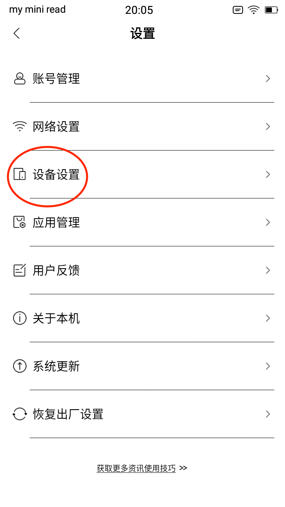
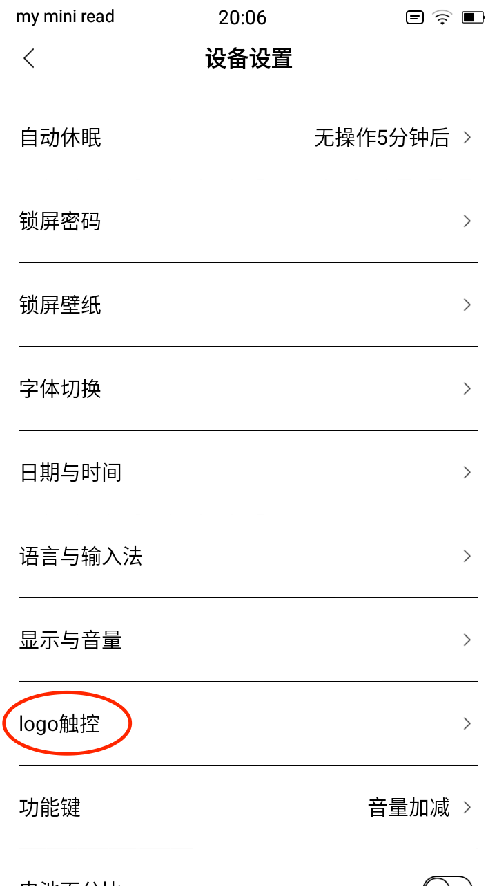
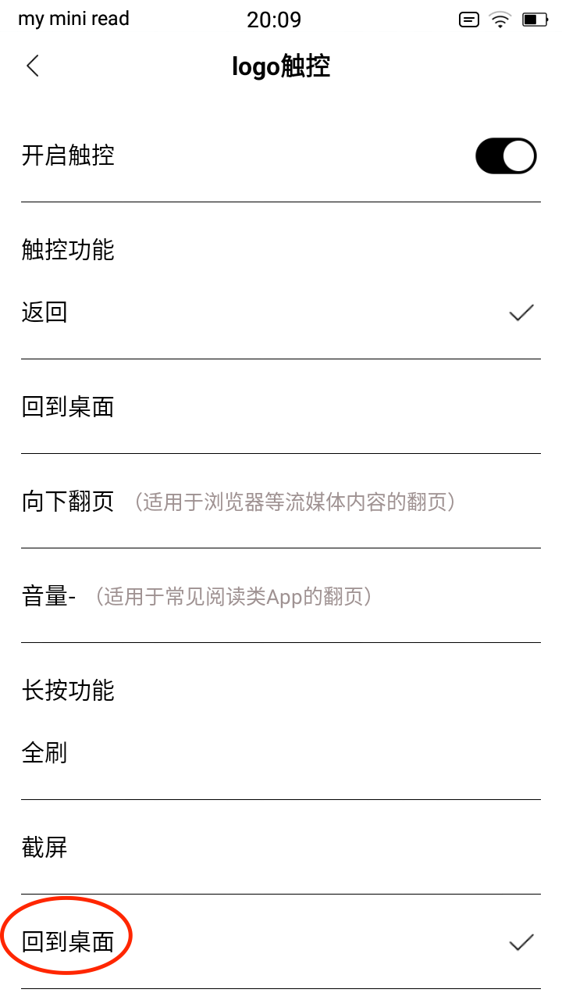

# Xiaomi Inkpalm 5 English Configuration

In 2023 many Inkpalm 5 devices started shipping with English enabled by default. See this [discussion for more information](https://github.com/philips/inkpalm-5-adb-english/issues/6). If your device didn't ship with this new firmware you can follow the old instructions to [change language of Xiaomi Inkpalm 5 to English via ADB](english-adb.md).

Once you have the Inkpalm 5 in the English mode you can take some additional steps to improve the device.

1. [Install an English Launcher](#install-an-english-launcher)
2. [Change the Navigation Button](#change-the-navigation-button)
3. [Change the timezone](#change-the-timezone)
4. [Disable unneeded apps](#disable-unneeded-apps)
5. [Install Useful Apps like Kindle, Aurora Store, F-Droid](#install-useful-apps)
6. [Pro Tips](#pro-tips)
7. [Additional Resources](#additional-resources)

### Install an English Launcher

The pre-installed launcher is not in English. In this step, we'll change the launcher. 

- Download `com.jkuester.unlauncher.apk` from https://github.com/jkuester/unlauncher/releases/latest

```
adb install com.jkuester.unlauncher.apk
```

The original e-reader app in still there, it now appears as the "Moan" app on the launcher.

## Change the Navigation button

The logo button defaults to 'back' for short press, and 'refresh' for long press. The button functions can be changed in the settings e.g. long press can be changed to 'home'.





## Change the Timezone

The device is set to default timezone of China but you can change the timezone with the following command:
```shell
adb shell setprop persist.sys.timezone "Continent/City"
```
You'll find the exact timezone list here: [Wikipedia_TZ_List](https://en.wikipedia.org/wiki/List_of_tz_database_time_zones)

For example, I set my timezone with
```shell
adb shell setprop persist.sys.timezone "Europe/Amsterdam"
```

## Disable Unneeded apps

```
adb shell pm disable-user --user 0 com.duokan.einkreader                                                             
adb shell pm disable-user --user 0 com.moan.appstore
adb shell pm disable-user --user 0 com.zhangyue.read.iReader.eink                                                    
adb shell pm disable-user --user 0 cn.wps.moffice_eng.lite  
```

## Install Useful Apps

**Kindle** - a book reader and store from Amazon

- [Download and install Amazon App Store APK](https://www.amazon.com/gp/mas/get/android/ref=get_appstore?ie=UTF8&%2AVersion%2A=1&%2Aentries%2A=0)
- Login to your Amazon account in the Amazon App store
- Launch the pre-installed Kindle App

**F-Droid** - an app store for free open source android software

- [Download and install the F-Droid classic client](https://f-droid.org/en/packages/eu.bubu1.fdroidclassic/)
- Launch f-droid

**Aurora Store** - install Google Play applications

- [Download and install the Aurora Store](https://f-droid.org/packages/com.aurora.store/)
- Launch Aurora Store

## Pro Tips

**Avoiding Slow Keyboard Entry**

Entering text on the eink screen is a pain. Use this instead if you are connected via USB to a laptop:

```
adb shell input text TEXTTOENTER
```

### Additional Resources

* [Mobile Read Forum on Inkpalm 5](https://www.mobileread.com/forums/showthread.php?t=338605)
* [Getting root on the device](https://github.com/qwerty12/inkPalm-5-EPD105-root)

## Credits

This is a fork of the instructions from https://github.com/epodegrid/epd106-ADB
